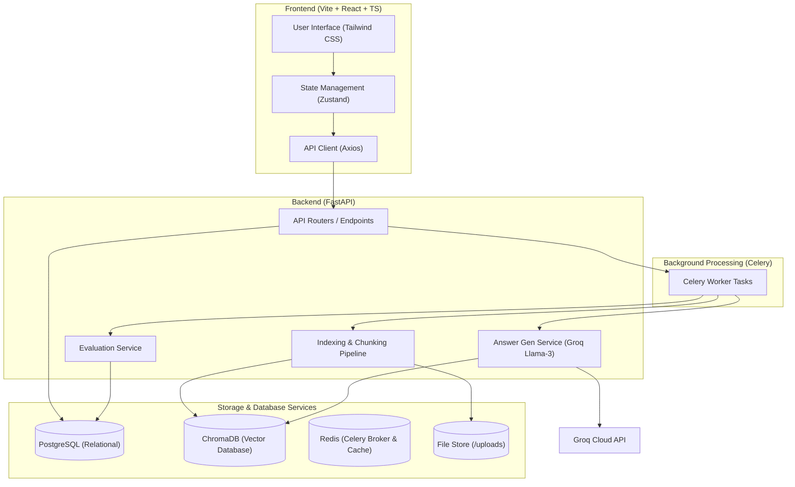

# 🔍 Due Diligence Questionnaire Agent

A full-stack RAG (Retrieval-Augmented Generation) solution designed to automate and streamline the due diligence questionnaire answering process. The system ingests and indexes reference documents (PDF, DOCX, XLSX, PPTX), parses standard due diligence questionnaires (e.g., ILPA v1.2), automatically generates answers with precise chunk-level citations and confidence scores, and supports human review workflows and evaluation against ground-truth.

---

## 🏗️ Architecture & Component Boundaries

The system follows a distributed architecture with separate services for the API, background task processing, vector search, relational storage, and the web front-end.



### Component Breakdown
1. **Frontend**: A responsive dashboard that enables project management, document upload, answer review (with side-by-side editing), and evaluation reporting.
2. **Backend (FastAPI)**: Serves REST endpoints, coordinates long-running async tasks via Celery, and interacts with PostgreSQL and ChromaDB.
3. **Celery Workers**: Process resource-heavy operations asynchronously (e.g., parsing PDFs, generating embeddings, generating responses via LLMs).
4. **Relational Database (PostgreSQL)**: Holds structural information about projects, questionnaires, sections, questions, answers, human reviews, and background requests.
5. **Vector Store (ChromaDB)**: Houses embedded document chunks (`all-MiniLM-L6-v2`) used for semantic search during retrieval-augmented generation.

---

## 🛠️ Tech Stack

- **Backend**: Python 3.10+, FastAPI, SQLAlchemy, Alembic, Celery, PyPDF2, python-docx, openpyxl, python-pptx
- **Frontend**: React 18, Vite, TypeScript, Tailwind CSS, Radix UI, Zustand, Lucide Icons, Axios, React Hook Form
- **AI & Vector Search**: ChromaDB, Sentence-Transformers, Groq API (Llama-3-70b)
- **Infrastructure & Services**: PostgreSQL 15, Redis 7 (Alpine), Docker & Docker Compose

---

## 🌟 Key Features & Core Workflows

### 1. Document Ingestion & Multi-Layer Indexing
- **Supported Formats**: Ingests PDF, DOCX, XLSX, and PPTX reference documents.
- **Hierarchical Indexing**:
  - **Layer 1 (Answer Retrieval)**: Stores text-only semantic chunks optimized for context retrieval.
  - **Layer 2 (Citation Verification)**: Tracks detailed layout meta (such as page/sheet numbers) to map citations directly back to the source documents.

### 2. Project Lifecycle & Corpus Sync
- Projects can be scoped to a specific list of documents or to `ALL_DOCS`.
- **Automatic Invalidation**: When a new document is indexed, any project scoped to `ALL_DOCS` automatically transitions to an `OUTDATED` status. This signals the user that newer information is available and allows them to trigger an asynchronous updates.

### 3. Answer Generation with Citations & Confidence
- Generates answers using Groq's Llama-3-70b model.
- Each answer is structured to include:
  1. **Answerability Statement**: Explicitly stating if the reference corpus contains sufficient information to answer.
  2. **Chunk-Level Citations**: Explicit references back to pages, document titles, and specific chunks.
  3. **Confidence Score**: Quantitative confidence metric based on retrieval match strength and LLM self-evaluation.
- **Fallback Flow**: If no documents are relevant, the system falls back gracefully to flag missing information without hallucinating.

### 4. Human-in-the-Loop Review
- Interface allowing domain experts to mark answers as `CONFIRMED`, `REJECTED`, `MANUAL_UPDATED`, or `MISSING_DATA`.
- Preserves AI-generated answers and manual overrides side-by-side to maintain a complete audit log.

### 5. Evaluation & Performance Reporting
- Evaluates AI-generated responses against human ground-truth answers.
- Measures similarity using two main metrics: **Semantic Similarity** (cosine similarity of embeddings) and **Keyword Overlap** (lexical analysis).
- Reports scores along with a qualitative explanation of deviations.

---

## 📂 Project Directory Structure

- [docker-compose.yml](file:///d:/My/my%20projects/due_diligence/DueDiligence/docker-compose.yml) — Dev database and Redis infrastructure configuration
- [README.md](file:///d:/My/my%20projects/due_diligence/DueDiligence/README.md) — Main documentation and guidelines (this file)
- [data/](file:///d:/My/my%20projects/due_diligence/DueDiligence/data) — Directory containing evaluation PDFs and input questionnaires
- [docs/](file:///d:/My/my%20projects/due_diligence/DueDiligence/docs) — Additional project documentation and specs
  - [QUESTIONNAIRE_AGENT_TASKS.md](file:///d:/My/my%20projects/due_diligence/DueDiligence/docs/QUESTIONNAIRE_AGENT_TASKS.md) — Acceptance criteria and task details
- [backend/](file:///d:/My/my%20projects/due_diligence/DueDiligence/backend) — FastAPI backend source, configuration, and test suites
  - [app.py](file:///d:/My/my%20projects/due_diligence/DueDiligence/backend/app.py) — Application entrypoint and startup hooks
  - [requirements.txt](file:///d:/My/my%20projects/due_diligence/DueDiligence/backend/requirements.txt) — Python dependency list
  - [alembic.ini](file:///d:/My/my%20projects/due_diligence/DueDiligence/backend/alembic.ini) — Alembic configurations
  - [.env.example](file:///d:/My/my%20projects/due_diligence/DueDiligence/backend/.env.example) — Template configuration environment file
  - [src/api/](file:///d:/My/my%20projects/due_diligence/DueDiligence/backend/src/api) — FastAPI routing configurations
  - [src/models/](file:///d:/My/my%20projects/due_diligence/DueDiligence/backend/src/models) — SQLAlchemy schemas and Pydantic validation models
  - [src/services/](file:///d:/My/my%20projects/due_diligence/DueDiligence/backend/src/services) — Core business logic, RAG pipelines, and evaluation routines
  - [src/indexing/](file:///d:/My/my%20projects/due_diligence/DueDiligence/backend/src/indexing) — Parsers and multi-layered indexers
  - [src/storage/](file:///d:/My/my%20projects/due_diligence/DueDiligence/backend/src/storage) — Database initializers and sessions
    - [database.py](file:///d:/My/my%20projects/due_diligence/DueDiligence/backend/src/storage/database.py) — Table creation and DB session handlers
  - [src/workers/](file:///d:/My/my%20projects/due_diligence/DueDiligence/backend/src/workers) — Celery task worker modules
    - [indexing_worker.py](file:///d:/My/my%20projects/due_diligence/DueDiligence/backend/src/workers/indexing_worker.py) — Background document ingestion workers
    - [answer_worker.py](file:///d:/My/my%20projects/due_diligence/DueDiligence/backend/src/workers/answer_worker.py) — Background answer generator and evaluator workers
  - [src/utils/](file:///d:/My/my%20projects/due_diligence/DueDiligence/backend/src/utils) — Shared exceptions and utilities
  - [tests/](file:///d:/My/my%20projects/due_diligence/DueDiligence/backend/tests) — Backend Pytest integration and unit tests
- [frontend/](file:///d:/My/my%20projects/due_diligence/DueDiligence/frontend) — Vite React Single Page Application
  - [package.json](file:///d:/My/my%20projects/due_diligence/DueDiligence/frontend/package.json) — UI package dependencies and script targets
  - [vite.config.ts](file:///d:/My/my%20projects/due_diligence/DueDiligence/frontend/vite.config.ts) — Vite build configuration
  - [.env.example](file:///d:/My/my%20projects/due_diligence/DueDiligence/frontend/.env.example) — Frontend env template file
  - [src/pages/](file:///d:/My/my%20projects/due_diligence/DueDiligence/frontend/src/pages) — UI Page level screen layouts
  - [src/components/](file:///d:/My/my%20projects/due_diligence/DueDiligence/frontend/src/components) — Shared interactive component trees
  - [src/stores/](file:///d:/My/my%20projects/due_diligence/DueDiligence/frontend/src/stores) — Zustand global store configurations
  - [src/services/](file:///d:/My/my%20projects/due_diligence/DueDiligence/frontend/src/services) — Axios API integration service helpers
  - [src/types/](file:///d:/My/my%20projects/due_diligence/DueDiligence/frontend/src/types) — TypeScript structural representations matching backend APIs

---

## 🚀 Setup & Installation Instructions

Follow these steps to run the complete environment locally.

### Prerequisites
Make sure you have the following installed on your machine:
- [Docker Desktop](https://www.docker.com/products/docker-desktop/)
- [Python 3.10+](https://www.python.org/downloads/)
- [Node.js v18+](https://nodejs.org/)
- A **Groq API Key** (Get one from [Groq Cloud Console](https://console.groq.com/))

---

### Step 1: Start Infrastructure Containers
From the root `DueDiligence` directory, run Docker Compose to spin up PostgreSQL and Redis:
```bash
docker-compose up -d
```
This runs:
- **PostgreSQL** on `localhost:5432` (User/Password/Database: `postgres`/`postgres`/`due_diligence`)
- **Redis** on `localhost:6379` (Used as Celery broker and backend)

---

### Step 2: Configure & Start Backend

1. **Navigate to the backend folder**:
   ```bash
   cd backend
   ```

2. **Create a Virtual Environment**:
   ```bash
   python -m venv venv
   ```

3. **Activate the Virtual Environment**:
   - **Windows (PowerShell)**:
     ```powershell
     .\venv\Scripts\Activate.ps1
     ```
   - **Windows (CMD)**:
     ```cmd
     .\venv\Scripts\activate.bat
     ```
   - **macOS/Linux**:
     ```bash
     source venv/bin/activate
     ```

4. **Install Dependencies**:
   ```bash
   pip install -r requirements.txt
   ```

5. **Set Environment Variables**:
   Copy [.env.example](file:///d:/My/my%20projects/due_diligence/DueDiligence/backend/.env.example) to `.env`:
   ```bash
   cp .env.example .env
   ```
   Open the `.env` file and insert your **Groq API Key**:
   ```env
   GROQ_API_KEY=gsk_...
   SECRET_KEY=generate_a_random_jwt_secret_key_here
   ```

6. **Run Backend Application**:
   FastAPI will automatically create standard DB tables on startup. Run:
   ```bash
   python app.py
   ```
   The API will now be listening at `http://localhost:8000`. You can explore the Swagger API docs at `http://localhost:8000/docs`.

7. **Run Celery Workers** (in separate terminals inside `backend` with the venv active):
   - **Start Indexing Worker**:
     ```bash
     celery -A src.workers.indexing_worker.celery_app worker --loglevel=info -P threads
     ```
   - **Start Answer Generation Worker**:
     ```bash
     celery -A src.workers.answer_worker.celery_app worker --loglevel=info -P threads
     ```
     > **Note**: On Windows, the `-P threads` or `-P solo` pool flag is recommended for Celery processes to prevent concurrency errors.

---

### Step 3: Configure & Start Frontend

1. **Navigate to the frontend folder**:
   ```bash
   cd ../frontend
   ```

2. **Install Node Packages**:
   ```bash
   npm install
   ```

3. **Set Environment Variables**:
   Copy [.env.example](file:///d:/My/my%20projects/due_diligence/DueDiligence/frontend/.env.example) to `.env`:
   ```bash
   cp .env.example .env
   ```
   Verify it targets the local FastAPI server:
   ```env
   VITE_API_URL=http://localhost:8000
   ```

4. **Start Vite Development Server**:
   ```bash
   npm run dev
   ```
   Open your browser and navigate to the address shown in the output (usually `http://localhost:5173`).

---

## 🧪 Dataset Testing & Verification Plan

You can perform end-to-end smoke tests using the sample documents provided in the [data/](file:///d:/My/my%20projects/due_diligence/DueDiligence/data) directory.

### Test Workflow Steps
1. **Upload & Index Reference Documents**:
   Use the frontend Document Management screen to upload and index the reference files located in `data/`:
   - `20260110_MiniMax_Accountants_Report.pdf`
   - `20260110_MiniMax_Audited_Consolidated_Financial_Statements.pdf`
   - `20260110_MiniMax_Global_Offering_Prospectus.pdf`
   - `20260110_MiniMax_Industry_Report.pdf`

2. **Create a Project**:
   - Parse `data/ILPA_Due_Diligence_Questionnaire_v1.2.pdf` as the questionnaire input.
   - Specify the project scope as `ALL_DOCS`.
   - The questionnaire sections and questions will be automatically structured.

3. **Generate Answers**:
   - Trigger the generation of all answers.
   - Celery workers will invoke the RAG process using ChromaDB retrieval and Groq LLM processing.
   - Confirm that generated answers contain **Answerability**, **Citations** (specific source page numbers/chunks), and a **Confidence Score**.

4. **Verify Outdated Sync Behavior**:
   - Upload and index a new document in the Document Management page.
   - Check the project list/detail dashboard.
   - Confirm that your `ALL_DOCS` project status has transitioned to `OUTDATED`.
   - Trigger an update/re-generation to pull in the new contextual document.

5. **Review Workflow**:
   - Approve, reject, or manually update answers in the Question Review view.
   - Verify that your manual edits persist side-by-side with the original AI response.

6. **Run Evaluation**:
   - Compare the final reviewed answers against ground truth using the evaluation screen to see semantic and keyword comparison metrics.

---

## 🧪 Running Automated Tests

To validate database models, service layers, and API endpoint routing, run the backend tests:
```bash
cd backend
pytest -v
```
This runs the comprehensive endpoint and service tests using a temporary local database configured via [conftest.py](file:///d:/My/my%20projects/due_diligence/DueDiligence/backend/tests/conftest.py).
